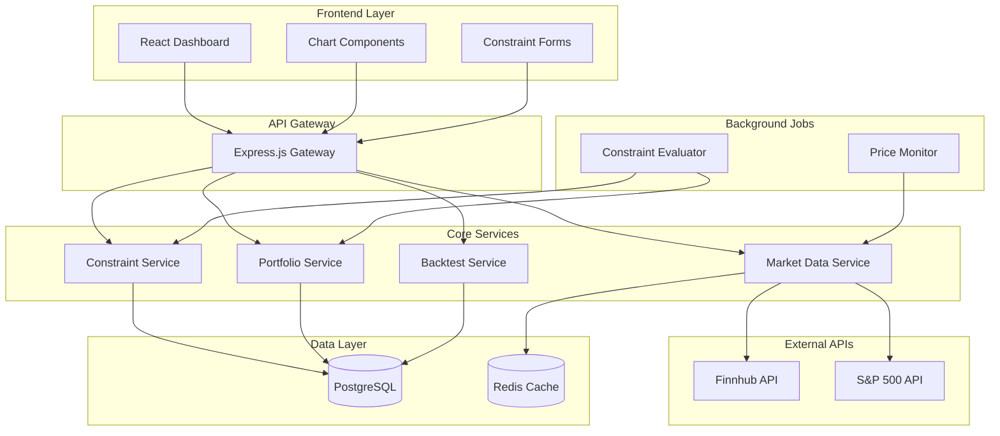

# Design Document

## Overview

The Algorithmic Trading Platform is a web-based application that enables users to create custom trading constraints, monitor portfolio performance, and compare results against market benchmarks. The system integrates with external stock market APIs to provide real-time data and executes trading logic based on user-defined percentage-based triggers.

The platform follows a microservices architecture with separate services for constraint management, portfolio tracking, market data integration, and performance analytics. The frontend provides an intuitive dashboard for constraint creation, portfolio monitoring, and historical analysis.

## Architecture

### High-Level Architecture



### Technology Stack

- **Frontend**: React.js with TypeScript, Chart.js for visualizations
- **Backend**: Node.js with Express.js
- **Database**: PostgreSQL for persistent data, Redis for caching
- **External APIs**: Finnhub API for stock data
- **Background Processing**: Node.js cron jobs or Bull Queue
- **Authentication**: JWT tokens
- **Deployment**: Docker containers

## Components and Interfaces

### Frontend Components

#### Dashboard Component
- **Purpose**: Main interface displaying portfolio overview and performance metrics
- **Props**: `userId`, `portfolioData`, `marketComparison`
- **State**: Current portfolio value, gains/losses, benchmark comparison
- **Key Methods**: `refreshPortfolio()`, `updateTimeRange()`

#### Constraint Manager Component
- **Purpose**: Interface for creating, editing, and managing trading constraints
- **Props**: `constraints`, `onConstraintCreate`, `onConstraintUpdate`
- **State**: Active constraints list, form validation state
- **Key Methods**: `createConstraint()`, `editConstraint()`, `deleteConstraint()`

#### Performance Chart Component
- **Purpose**: Visualizes portfolio performance vs market benchmarks
- **Props**: `portfolioData`, `benchmarkData`, `timeRange`
- **State**: Chart configuration, data series
- **Key Methods**: `updateChart()`, `changeTimeRange()`

### Backend Services

#### Constraint Service
```typescript
interface ConstraintService {
  createConstraint(userId: string, constraint: TradingConstraint): Promise<Constraint>
  updateConstraint(constraintId: string, updates: Partial<TradingConstraint>): Promise<Constraint>
  deleteConstraint(constraintId: string): Promise<void>
  getUserConstraints(userId: string): Promise<Constraint[]>
  evaluateConstraints(stockSymbol: string, currentPrice: number): Promise<TriggerEvent[]>
}

interface TradingConstraint {
  stockSymbol: string
  buyTriggerPercent: number
  sellTriggerPercent: number
  profitTriggerPercent: number
  buyAmount: number
  sellAmount: number
  isActive: boolean
}
```

#### Portfolio Service
```typescript
interface PortfolioService {
  getPortfolio(userId: string): Promise<Portfolio>
  updatePosition(userId: string, stockSymbol: string, quantity: number, price: number): Promise<void>
  calculatePerformance(userId: string, timeRange: string): Promise<PerformanceMetrics>
  getPositions(userId: string): Promise<Position[]>
}

interface Portfolio {
  userId: string
  totalValue: number
  totalGainLoss: number
  totalGainLossPercent: number
  positions: Position[]
  lastUpdated: Date
}
```

#### Market Data Service
```typescript
interface MarketDataService {
  getCurrentPrice(stockSymbol: string): Promise<number>
  getHistoricalData(stockSymbol: string, startDate: Date, endDate: Date): Promise<PriceData[]>
  getBenchmarkData(timeRange: string): Promise<BenchmarkData>
  subscribeToRealTimeUpdates(symbols: string[]): void
}

interface PriceData {
  symbol: string
  price: number
  timestamp: Date
  volume: number
}
```

#### Backtest Service
```typescript
interface BacktestService {
  runBacktest(constraint: TradingConstraint, startDate: Date, endDate: Date): Promise<BacktestResult>
  compareToMarket(backtestResult: BacktestResult, benchmarkData: BenchmarkData): Promise<Comparison>
}

interface BacktestResult {
  totalTrades: number
  successfulTrades: number
  totalReturn: number
  maxDrawdown: number
  sharpeRatio: number
  trades: Trade[]
}
```

## Data Models

### Database Schema

#### Users Table
```sql
CREATE TABLE users (
  id UUID PRIMARY KEY DEFAULT gen_random_uuid(),
  email VARCHAR(255) UNIQUE NOT NULL,
  password_hash VARCHAR(255) NOT NULL,
  created_at TIMESTAMP DEFAULT CURRENT_TIMESTAMP,
  updated_at TIMESTAMP DEFAULT CURRENT_TIMESTAMP
);
```

#### Constraints Table
```sql
CREATE TABLE constraints (
  id UUID PRIMARY KEY DEFAULT gen_random_uuid(),
  user_id UUID REFERENCES users(id) ON DELETE CASCADE,
  stock_symbol VARCHAR(10) NOT NULL,
  buy_trigger_percent DECIMAL(5,2) NOT NULL,
  sell_trigger_percent DECIMAL(5,2) NOT NULL,
  profit_trigger_percent DECIMAL(5,2),
  buy_amount DECIMAL(10,2) NOT NULL,
  sell_amount DECIMAL(10,2) NOT NULL,
  is_active BOOLEAN DEFAULT true,
  created_at TIMESTAMP DEFAULT CURRENT_TIMESTAMP,
  updated_at TIMESTAMP DEFAULT CURRENT_TIMESTAMP
);
```

#### Positions Table
```sql
CREATE TABLE positions (
  id UUID PRIMARY KEY DEFAULT gen_random_uuid(),
  user_id UUID REFERENCES users(id) ON DELETE CASCADE,
  stock_symbol VARCHAR(10) NOT NULL,
  quantity DECIMAL(10,4) NOT NULL,
  average_cost DECIMAL(10,2) NOT NULL,
  current_price DECIMAL(10,2),
  last_updated TIMESTAMP DEFAULT CURRENT_TIMESTAMP,
  UNIQUE(user_id, stock_symbol)
);
```

#### Trade History Table
```sql
CREATE TABLE trade_history (
  id UUID PRIMARY KEY DEFAULT gen_random_uuid(),
  user_id UUID REFERENCES users(id) ON DELETE CASCADE,
  constraint_id UUID REFERENCES constraints(id),
  stock_symbol VARCHAR(10) NOT NULL,
  trade_type VARCHAR(10) NOT NULL, -- 'BUY' or 'SELL'
  trigger_type VARCHAR(20) NOT NULL, -- 'PRICE_DROP', 'PRICE_RISE', 'PROFIT_TARGET'
  quantity DECIMAL(10,4) NOT NULL,
  price DECIMAL(10,2) NOT NULL,
  trigger_price DECIMAL(10,2) NOT NULL,
  executed_at TIMESTAMP DEFAULT CURRENT_TIMESTAMP
);
```

### Redis Cache Structure

#### Price Cache
```
stock_price:{symbol} -> {
  price: number,
  timestamp: ISO string,
  volume: number
}
TTL: 60 seconds
```

#### Market Data Cache
```
market_data:sp500:{timerange} -> {
  data: PriceData[],
  lastUpdated: ISO string
}
TTL: 300 seconds (5 minutes)
```

## Error Handling

### API Error Responses
```typescript
interface APIError {
  code: string
  message: string
  details?: any
  timestamp: Date
}

// Standard error codes
enum ErrorCodes {
  INVALID_CONSTRAINT = 'INVALID_CONSTRAINT',
  MARKET_DATA_UNAVAILABLE = 'MARKET_DATA_UNAVAILABLE',
  INSUFFICIENT_FUNDS = 'INSUFFICIENT_FUNDS',
  RATE_LIMIT_EXCEEDED = 'RATE_LIMIT_EXCEEDED',
  CONSTRAINT_NOT_FOUND = 'CONSTRAINT_NOT_FOUND'
}
```

### Error Handling Strategy
1. **API Failures**: Implement exponential backoff with 3 retry attempts
2. **Rate Limiting**: Queue requests when limits are exceeded
3. **Data Validation**: Validate all constraint parameters before saving
4. **Graceful Degradation**: Use cached data when real-time data is unavailable
5. **User Feedback**: Provide clear error messages in the UI

### Logging Strategy
- **Info Level**: Successful constraint triggers, portfolio updates
- **Warning Level**: API rate limits, temporary data unavailability
- **Error Level**: Failed API calls, database errors, invalid constraints
- **Debug Level**: Detailed constraint evaluation logs

## Testing Strategy

### Unit Testing
- **Services**: Test all business logic methods with mock data
- **Components**: Test React components with React Testing Library
- **Utilities**: Test calculation functions and data transformations
- **Coverage Target**: 90% code coverage

### Integration Testing
- **API Endpoints**: Test all REST endpoints with real database
- **External APIs**: Test with mock API responses and error scenarios
- **Database Operations**: Test CRUD operations and data integrity
- **Background Jobs**: Test constraint evaluation and price monitoring

### End-to-End Testing
- **User Workflows**: Test complete user journeys from constraint creation to portfolio monitoring
- **Performance Testing**: Test system performance under load
- **Browser Testing**: Test across different browsers and devices

### Testing Tools
- **Unit Tests**: Jest, React Testing Library
- **Integration Tests**: Supertest, Test Containers
- **E2E Tests**: Playwright or Cypress
- **Performance Tests**: Artillery or k6

### Test Data Strategy
- **Mock Data**: Use realistic stock symbols and price data
- **Test Database**: Separate test database with seed data
- **API Mocking**: Mock external API responses for consistent testing
- **User Scenarios**: Create test users with various constraint configurations